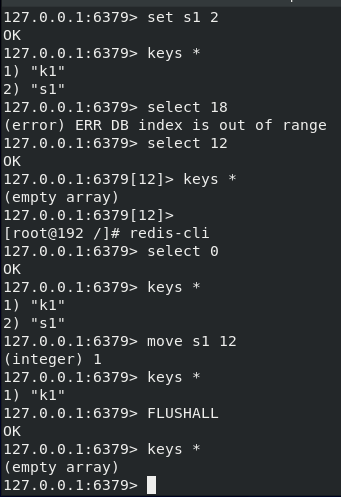
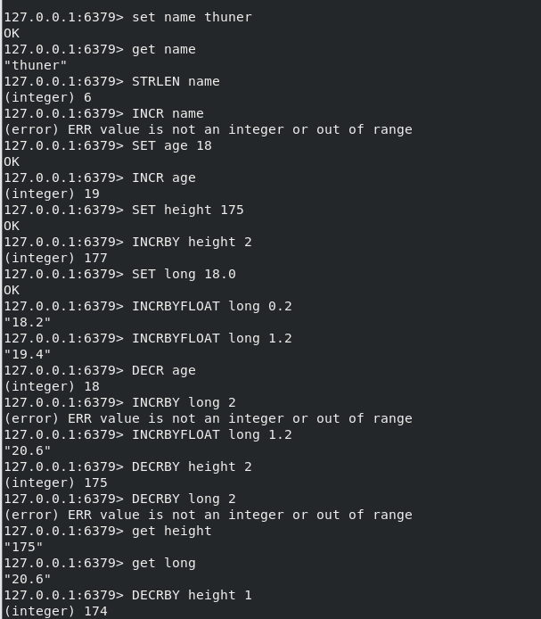

## 基础指令
命令简而易懂,截图展示



## 基本数据类型

| 类型   | 类型说明                                                     | 场景                                                         |
| ------ | ------------------------------------------------------------ | ------------------------------------------------------------ |
| String | 字符串,其他数据类型的基础类型,可以包含任何数据,比如jpg图片或者序列化的对象,一个键最大能存储512M | _                                                            |
| Hash   | 散列,是由与值相关联的字段组成的内容. 字段和值都是字符串。hash 是一个 string 类型的 field 和 value 的映射表，hash 特别适合用于存储对象,并且可以像数据库中update一个属性一样只修改某一项属性值. | 存储、读取、修改用户属性                                     |
| List   | 双向链表,根据插入顺序排序的字符串元素的集合,增删快,提供了操作某一段元素的API | 1.最新消息排行等功能(比如朋友圈的时间线)2.消息队列           |
| Set    | 未排序的字符串元素集合, 集合中的数据是不重复的. 1、添加、删除,查找的复杂度都是O(1)  2、为集合提供了求交集、并集、差集等操作 | 1.共同好友 2.利用唯一性,统计访问网站的所有独立IP 3. 好友推荐时,根据tag求交集,大于某个阈值就可以推荐 |
| ZSet   | 与Set类似,但每个字符串元素都与一个数值的相关联.且按数值大小进行排序. 数据插入集合时, 已经进行天然排序 | 1. 排行榜  2. 带权重的消息队列                               |


### String


### Hash

* HSET key field value
  
  为哈希表中的字段赋值。

  如果哈希表不存在，一个新的哈希表被创建并进行 HSET 操作。

  如果字段已经存在于哈希表中，旧值将被覆盖。


  ```shell
     127.0.0.1:6379> Hset user uname thunder
    (integer) 1
    127.0.0.1:6379> HGET user uname
    "thunder"
    127.0.0.1:6379> HSET user uname chen
    (integer) 0
    127.0.0.1:6379> HGET user uname
    "chen"
    127.0.0.1:6379> HGET user uname
    "chen"
    127.0.0.1:6379> 

  ```

* HMSET key field1 value1 [field2 value2 ]

    用于同时将多个 field-value (字段-值)对设置到哈希表中。

    此命令会覆盖哈希表中已存在的字段。

    如果哈希表不存在，会创建一个空哈希表，并执行 HMSET 操作。

    ```shell
    127.0.0.1:6379> HMset myname field1 thunder field2 chen field3 clear field4 love
    OK
    127.0.0.1:6379> HGETALL myname
    1) "field1"
    2) "thunder"
    3) "field2"
    4) "chen"
    5) "field3"
    6) "clear"
    7) "field4"
    8) "love"
    127.0.0.1:6379> HGET field1
    (error) ERR wrong number of arguments for 'hget' command
    127.0.0.1:6379> HMget field1
    (error) ERR wrong number of arguments for 'hmget' command
    127.0.0.1:6379> HMget field1
    (error) ERR wrong number of arguments for 'hmget' command
    127.0.0.1:6379> HMGET myname
    (error) ERR wrong number of arguments for 'hmget' command
    127.0.0.1:6379> HGET myname
    (error) ERR wrong number of arguments for 'hget' command
    127.0.0.1:6379> HGET user
    (error) ERR wrong number of arguments for 'hget' command
    127.0.0.1:6379> HGETALL myname
    1) "field1"
    2) "thunder"
    3) "field2"
    4) "chen"
    5) "field3"
    6) "clear"
    7) "field4"
    8) "love"
    127.0.0.1:6379> 

    ```
* HDEL key field1 [field2]
  
    删除哈希表 key 中的一个或多个指定字段，不存在的字段将被忽略。

    ```shell
    127.0.0.1:6379> HGETALL myname
    1) "field1"
    2) "thunder"
    3) "field2"
    4) "chen"
    5) "field3"
    6) "clear"
    7) "field4"
    8) "love"
    127.0.0.1:6379> HDEL myname field1
    (integer) 1
    127.0.0.1:6379> HGETALL myname
    1) "field2"
    2) "chen"
    3) "field3"
    4) "clear"
    5) "field4"
    6) "love"
    127.0.0.1:6379> HDEL myname field2
    (integer) 1
    127.0.0.1:6379> HGETALL myname
    1) "field3"
    2) "clear"
    3) "field4"
    4) "love"
    127.0.0.1:6379> 
    ```
* HGET key field
  
  获取存储在哈希表中指定字段的值。

  ```shell
    127.0.0.1:6379> hset test name thuner
    (integer) 1
    127.0.0.1:6379> HGET test name
    "thuner"
    127.0.0.1:6379> 

  ```
* HGETALL key

  获取在哈希表中指定 key 的所有字段和值。

  ```shell
    127.0.0.1:6379> HMSET testname one onevalue two twovalue
    OK
    127.0.0.1:6379> HGETALL testname
    1) "one"
    2) "onevalue"
    3) "two"
    4) "twovalue"
    127.0.0.1:6379> 
  ```

* HEXISTS key field

    查看哈希表 key 中，指定的字段是否存在。
    
    如果哈希表含有给定字段，返回 1 。 如果哈希表不含有给定字段，或 key 不存在，返回 0 。

    ```shell
    127.0.0.1:6379> HEXISTS user unname
    (integer) 0
    127.0.0.1:6379> HEXISTS myname field3
    (integer) 1
    127.0.0.1:6379> 
    ```
    
### List

> 太累了, 直接上代码吧, 链表的增删改查

```shell
#新增
127.0.0.1:6379> LPUSH lb 11 22 33
(integer) 3
#区间查找
127.0.0.1:6379> LRANGE ll 0 2
(empty array)
127.0.0.1:6379> LRANGE lb  0 2
1) "33"
2) "22"
3) "11"
#新增 before/after: 11前面新增00
127.0.0.1:6379> LINSERT lb  before 11 00
(integer) 4
127.0.0.1:6379> LRANGE lb 0 4
1) "33"
2) "22"
3) "00"
4) "11"
#获取某个元素
127.0.0.1:6379> LINDEX lb 3
"11"
#获取链表长度
127.0.0.1:6379> LLEN lb
(integer) 4
#删除链表头部
127.0.0.1:6379> lpop lb
"33"
127.0.0.1:6379> LRANGE lb 0 4
1) "22"
2) "00"
3) "11"
#删除尾部
127.0.0.1:6379> RPOP lb
"11"
127.0.0.1:6379> LRANGE lb 0 4
1) "22"
2) "00"
127.0.0.1:6379> 
```

### 集合Set

太累了, 直接上代码吧
```shell
  #SADD 添加
  127.0.0.1:6379> SADD s1 11 22 33 44
  (integer) 4
  #SMEMBERS 查看集合
  127.0.0.1:6379> SMEMBERS s1
  1) "11"
  2) "22"
  3) "33"
  4) "44"
  #SCARD 查看集合长度
  127.0.0.1:6379> SCARD s1
  (integer) 4
  #SRANDMEMBER 随机获取集合一个值
  127.0.0.1:6379> SRANDMEMBER s1
  "44"
  127.0.0.1:6379> SRANDMEMBER s1
  "33"
  127.0.0.1:6379> SRANDMEMBER s1
  "11"
  127.0.0.1:6379> SRANDMEMBER s1
  "44"
  #随机获取两个
  127.0.0.1:6379> SRANDMEMBER s1 2
  1) "22"
  2) "11"
  #SREM删除几个某个值
  127.0.0.1:6379> SREM s1 11
  (integer) 1
  127.0.0.1:6379> SMEMBERS s1
  1) "22"
  2) "33"
  3) "44"
  127.0.0.1:6379> SRANDMEMBER s1 2
  1) "22"
  2) "33"
  # 删除某个值
  127.0.0.1:6379> SPOP s1 
  "44"
  127.0.0.1:6379> SMEMBERS s1
  1) "22"
  2) "33"
  127.0.0.1:6379> SADD s1 23 45
  (integer) 2
  127.0.0.1:6379> SADD s1 33 44 55 66 77 88
  (integer) 5
  #SPOP 随机删除集合中一个值
  127.0.0.1:6379> SPOP s1 
  "23"
  127.0.0.1:6379> SMEMBERS s1
  1) "22"
  2) "33"
  3) "44"
  4) "45"
  5) "55"
  6) "66"
  7) "77"
  8) "88"
  127.0.0.1:6379> SPOP s1 
  "33"
  127.0.0.1:6379> SPOP s1 
  "45"
  127.0.0.1:6379> SPOP s1 
  "44"
  127.0.0.1:6379> SPOP s1 
  "55"
  127.0.0.1:6379> SPOP s1 
  "66"
  127.0.0.1:6379> SPOP s1 
  "77"
  127.0.0.1:6379> SPOP s1 
  "22"
  127.0.0.1:6379> 
```
#### 有序集合

太累了, 直接上代码吧. 只是一些基本指令
```shell
  #添加
  127.0.0.1:6379> ZADD z1 5 u1 6 u2 7 u3 8 u4 9 u5
  (integer) 5
  #获取(默认升序排列)
  127.0.0.1:6379> ZRANGE z1 1 99
  1) "u2"
  2) "u3"
  3) "u4"
  4) "u5"
  127.0.0.1:6379> ZRANGE z1 0 99
  1) "u1"
  2) "u2"
  3) "u3"
  4) "u4"
  5) "u5"
  # 降序
  127.0.0.1:6379> ZREVRANGE z1 0 99
  1) "u5"
  2) "u4"
  3) "u3"
  4) "u2"
  5) "u1"
  #获取集合元素的实际排名
  127.0.0.1:6379> ZRANK z1 u1
  (integer) 0
  127.0.0.1:6379> ZRANK z1 u5
  (integer) 4
  #降序获取集合元素的实际排名
  127.0.0.1:6379> ZREVRANK z1 u4
  (integer) 1
  #获取集合长度
  127.0.0.1:6379> ZCARD z1
  (integer) 5
  #集合某个元素新增1
  127.0.0.1:6379> ZINCRBY z1 1 u2
  "7"
  127.0.0.1:6379> ZINCRBY z1 1 u1
  "6"
  127.0.0.1:6379> ZINCRBY z1 2 u1
  "8"
  #删除集合某个元素
  127.0.0.1:6379> ZREM z1 u2 
  (integer) 1
  127.0.0.1:6379> ZREVRANGE z1 0 99
  1) "u5"
  2) "u4"
  3) "u1"
  4) "u3"
  127.0.0.1:6379> 
```

#### 补充
```shell
  # 获取所有key
  127.0.0.1:6379> keys * 
  1) "username"
  2) "name"
  3) "age"
  4) "z1"
  5) "height"
  6) "s1"
  7) "lb"
  8) "test"
  9) "a"
  10) "testname"
  11) "long"
  12) "myname"
  #监测key的类型
  127.0.0.1:6379> type long
  string
  127.0.0.1:6379> type z1
  zset
  #删除某个key
  127.0.0.1:6379> DEL long
  (integer) 1
  127.0.0.1:6379> keys *
  1) "username"
  2) "name"
  3) "age"
  4) "z1"
  5) "height"
  6) "s1"
  7) "lb"
  8) "test"
  9) "a"
  10) "testname"
  11) "myname"
  #重命名某个key
  127.0.0.1:6379> RENAME a isa
  OK
  127.0.0.1:6379> keys *
  1) "username"
  2) "name"
  3) "age"
  4) "z1"
  5) "height"
  6) "isa"
  7) "s1"
  8) "lb"
  9) "test"
  10) "testname"
  11) "myname"
  127.0.0.1:6379> 
```