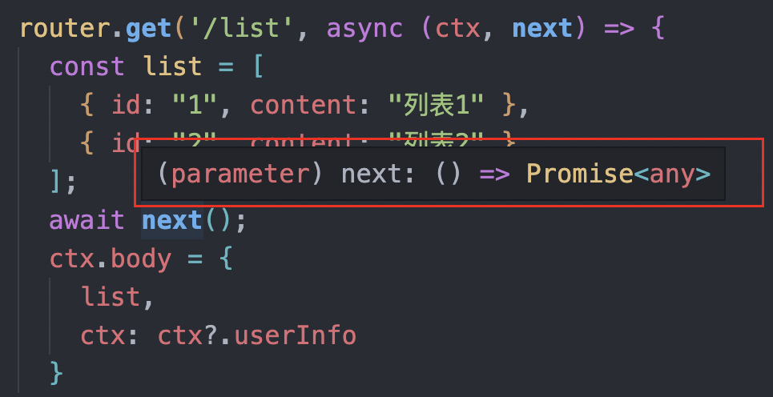
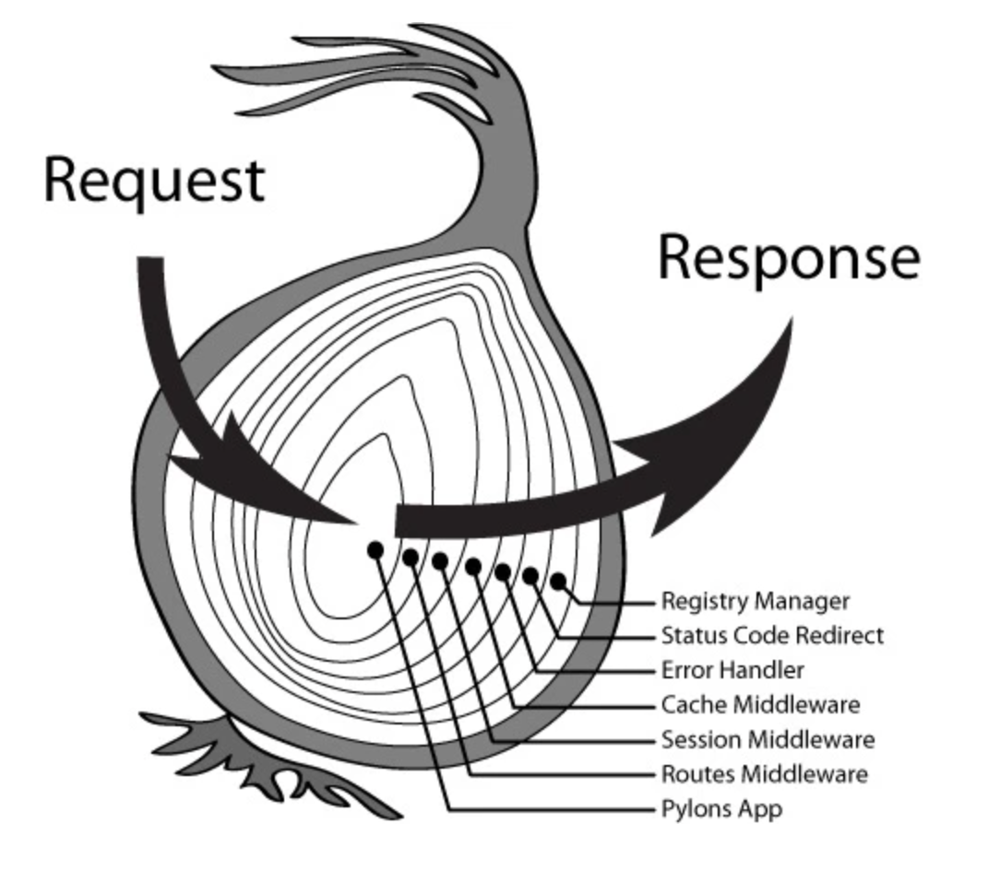

来分析了中间的执行顺序，可以得出两点结论：

1. 无论是 express 还是 koa，当中间件是同步代码并且调用了 next 函数，那么程序运行就会先执行每个中间件next函数之前的代码，当执行到最后一个中间件时，又会回滚执行每个中间件next 函数后的代码（类似于 数据结构中的 first in last out）。
2. 无论是 express 还是 koa，当遇到中间件中存在异步代码，就会停止向下执行，而是回到上一个中间件继续执行。

所以对于 express 和 koa 在中间件执行上，**表现形式**上是相同的。
而不相同之处就是在于 express 和 koa 在针对中间件存在异步代码时，**处理方式**不同（简单的来说也就是内部的 next 函数实现不同）。

## koa 和 express 不同的异步处理方式

假如存在这样的一个案例：存在两个中间件，一个是业务接口处理的中间件，一个是针对处理相同数据的中间件（比如：针对每个接口返回用户信息），这里的获取用户信息，就是异步操作。

那么针对 express 会写出以下代码：
```js
function getUserInfo () {
  return new Promise((resolve) => {
    setTimeout(() => {
      resolve({name: 'copyer', sex: 'man'})
    }, 1000)
  })
}

app.get('/list', (req, res, next) => {
  const list = [
    { id: "1", content: "列表1" },
    { id: "2", content: "列表2" },
  ];
  next();
  res.json({
    list,
    userInfo: req?.userInfo // 返回用户信息，需要通过下个中间件来获取
  })
});

app.use(async (req, res, next) => {
  // mock 异步代码，拿到用户信息
  const data = await getUserInfo();
  console.log(data); // { name: 'copyer', sex: 'man' }
  req.userInfo = data; // 设置用户信息
});
```
当我们访问 list 接口时，发现是拿不到用户信息（userInfo）,因为遇到是异步函数，就会停止继续执行下面的代码，而是回到上一个中间件继续执行，所以没有拿到用户信息。

koa 也是同样的道理，但是 koa 却是可以解决这个问题。代码如下：
```js
function getUserInfo() {
  return new Promise((resolve) => {
    setTimeout(() => {
      resolve({ name: "copyer", sex: "man" });
    }, 1000);
  });
}

router.get('/list', async (ctx, next) => {
  const list = [
    { id: "1", content: "列表1" },
    { id: "2", content: "列表2" },
  ];
  await next(); /*****************重点代码*********************/
  ctx.body = {
    list,
    ctx: ctx?.userInfo
  }
});

router.use(async (ctx, next) => {
  const res = await getUserInfo();
  console.log(res); // { name: 'copyer', sex: 'man' }
  ctx.userInfo = res; // 设置用户信息
});

app.use(router.routes())

```

看上面标记的**重点代码**，那么就是处理异步的关键。在 `next` 执行前面，加上一个 `await`，这样就能正常的拿到用户信息。

`await next()` 的意思就是等待下个中间件执行完成，那么这样用户信息也就设置成功了。

那么肯定有人这样想，那么我在 express 调用 next 函数时，也加上 await ，是不是也解决了？想法很美好，但是行不通的。为撒？

**express 中的 next 函数，返回值一个void，没有返回值。**

这里的 next 函数接受一个参数 err，也就是错误信息，针对全局异常处理的收集时，就会使用。


**koa 中的 next 函数，返回值一个Promise。**

这里的 next 函数不接受参数，所以全局错误的异常处理，需要另想它法。



***koa 和 express 在异步处理函数，最大的差别就是 next 函数实现不同，那么也就造成了中间件在异步上的使用不同。***

***koa 在上一个中间件拿取下一个异步中间件的数据，然后返回。express 却是不行，这是 express 设计上的缺陷。***

## 洋葱模型



中间件从上往下（从外往里），然后从下往上（从里往外）执行，无论是**同步还是异步**都满足，koa 是符合洋葱模型的。

express 是在**同步**的时候是满足洋葱模型的，但是**异步**的时候却是不能满足洋葱模型。
