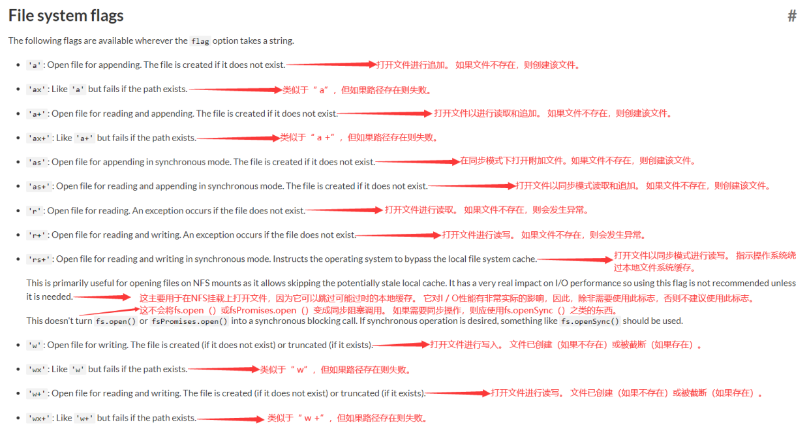

# 内置模块fs

- fs是File System的缩写, 表示文件系统

- 对于任何一个为服务器端服务的语言或者框架都会有自己的文件系统:

  - 服务器需要将各种数据、文件等放置到不同的地方;
  - 用户数据可能大多数是放到数据库中的;
  - 某些配置文件或者用户资源(图片、音视频)都是以文件的形式存在于操作系统上的;

- 借助Node封装的文件系统fs, 可以在任何操作系统上面直接去操作文件;

- 三种操作方式:

  - 方式一: 同步操作文件: 代码会被阻塞, 不会继续执行;
  - 方式二: 异步回调函数操作文件: 代码不会被阻塞, 需要传入回调函数, 当获取到结果时, 回调函数被执行;
  - 方式三: 异步Promise操作文件: 代码不会被阻塞, 通过fs.promises调用方法操作,会返回一个Promise. 可以通过then, catch进行处理;

  ## fs - flag
  

